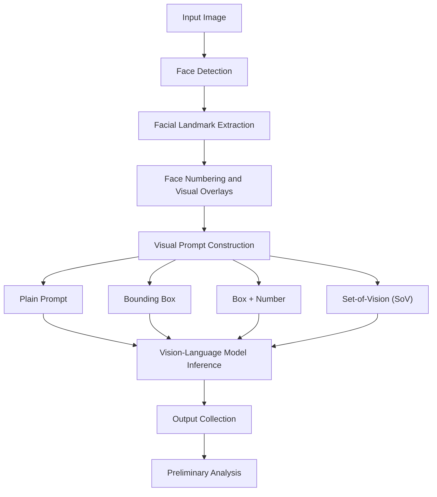

# Cross-Cultural and Demographic Robustness of Set-of-Vision Prompting for Zero-Shot Emotion Recognition

**Team Gradient | Phase 2 — Pipeline Implementation and Preliminary Testing**

## Table of Contents

- [Overview](#overview)
- [What Are We Building?](#what-are-we-building)
- [Pipeline Architecture](#pipeline-architecture)
- [Prompting Strategies](#prompting-strategies)
- [Implementation](#implementation)
- [Preliminary Findings](#preliminary-findings)
- [Limitations and Next Steps](#limitations-and-next-steps)
- [Repository Structure](#repository-structure)
- [Getting Started](#getting-started)
- [Team](#team)

## Overview

This project investigates **Set-of-Vision (SoV) prompting** for zero-shot facial emotion recognition. The broader objective is to examine whether visual prompting affects recognition performance across demographic groups, including race, gender, and age.

In Phase 2, we implement a modular pipeline for detecting faces, extracting facial landmarks, assigning face identifiers, constructing visual prompts, and running inference using a vision-language model (VLM).

The current phase establishes the technical foundation for the broader robustness study.

## What Are We Building?

Given an image containing multiple people, the pipeline:

1. Detects faces and identifies their locations.
2. Extracts facial landmarks, including the eyes, nose, and mouth corners.
3. Assigns identifiers to detected faces.
4. Creates visual overlays and different prompting conditions.
5. Sends the prepared inputs to a vision-language model.
6. Collects and examines the model's predictions.

The central challenge is whether the model can reliably identify individual faces and produce consistent emotion predictions when multiple people appear in the same image.

## Pipeline Architecture



<details>
<summary><strong>How does the pipeline work?</strong></summary>

- **Face detection:** Locates faces and generates bounding boxes.
- **Landmark extraction:** Identifies key facial points.
- **Face numbering:** Assigns identifiers to help distinguish individuals.
- **Visual prompt construction:** Prepares the input according to the selected prompting strategy.
- **Model inference:** Obtains zero-shot emotion predictions from the vision-language model.
- **Output analysis:** Examines face-count consistency, identifier recognition, and output quality.

The four prompting strategies are alternative experimental conditions. Each prepared condition is passed to the inference stage, after which its output can be analyzed.

</details>

## Prompting Strategies

The implementation compares four prompting conditions:

| Strategy | Description |
|---|---|
| **Plain** | Uses the original image without additional face annotations. |
| **Box** | Adds bounding boxes around detected faces. |
| **Box + Number** | Adds numbered face identifiers alongside bounding boxes. |
| **SoV** | Uses structured visual prompting to help the model reason about individual faces. |

Comparing these conditions provides a basis for investigating how visual structure influences model responses.

## Implementation

The pipeline is divided into stages so that each part can be developed and tested independently.

| File | Purpose |
|---|---|
| `sov_stage1_2_detect.py` | Face detection and landmark extraction |
| `Sov_stage3_5_overlay.py` | Face numbering and visual overlays |
| `sov_stage6_prompts.py` | Prompt construction and inference-job preparation |
| `sov_stage7_infer.py` | Vision-language model inference |
| `Sov_stage1_7.ipynb` | Notebook for running and inspecting the pipeline |
| `requirements_pytorch.txt` | PyTorch-oriented dependency specification |

The pipeline has been tested on a small set of sample images, producing face detections, visual overlays, prompt configurations, and inference outputs for inspection.

## Preliminary Findings

Initial testing confirms that the main processing stages can execute, but it also reveals challenges in model-output reliability.

- **Face identification:** The model sometimes misses expected face identifiers or generates identifiers that do not correspond to detected faces.
- **Face-count consistency:** The number of faces reported by the model can differ from the pipeline's detected face count.
- **Output generation:** Some constrained responses encounter token limits, while free-form responses can be difficult to parse consistently.

These observations are preliminary and based on a small sample. They are not ground-truth emotion recognition metrics and do not establish whether SoV outperforms the other prompting strategies.

## Limitations and Next Steps

<details>
<summary><strong>Current limitations</strong></summary>

- Evaluation has been conducted on a limited number of sample images.
- Face identification and output formatting remain unreliable in some cases.
- Ground-truth-based accuracy and macro-F1 comparisons have not yet been established.
- Demographic subgroup analysis and mitigation experiments remain part of the broader research objective.

</details>

**Planned next steps:**

1. Validate face detections, numbering, and visual overlays.
2. Improve face-identifier readability and reduce incomplete or malformed outputs.
3. Evaluate each prompting strategy on the same labeled examples.
4. Calculate emotion recognition metrics and compare performance across demographic groups.
5. Investigate and evaluate potential mitigation strategies.

## Repository Structure

```text
ml_project/
├── images/
├── sov pipeline/
│   ├── sov_stage1_2_detect.py
│   ├── Sov_stage3_5_overlay.py
│   ├── sov_stage6_prompts.py
│   └── sov_stage7_infer.py
├── ml_project.ipynb
├── Set-of-Vision Pipeline Architecture.png
├── requirements.txt
└── README.md
```

*This is the intended structure. Adjust the paths if the files are organized differently in the repository.*

## Getting Started

### 1. Clone the repository

```bash
git clone https://github.com/varunbabuvb/ml_project.git
cd ml_project
```

### 2. Install dependencies

```bash
pip install -r requirements.txt
```

Check that the installed dependency versions are compatible with the code and inference environment.

### 3. Run the notebook

Open `ml_project.ipynb` in Jupyter Notebook or VS Code and execute the cells in order. Ensure the required input images, model configuration, and other dependencies are available.

> **Note:** Full inference may require additional model access, hardware resources, and configuration.

## Team

**Team Gradient**

| Team Member | ID |
|---|---|
| Thammandra Saketh Ram | B24DS034 |
| Veeramallu Varun Babu | B24DS037 |
| Yellampati Lukesh | B24DS039 |

## Phase 2 Contribution

We implement a modular Set-of-Vision (SoV) prompting pipeline for zero-shot facial emotion recognition, integrating face detection, facial landmark extraction, face numbering, visual prompt construction, and vision-language model inference. Our preliminary testing identifies practical challenges in face-identifier recognition and model-output generation, establishing a foundation for investigating the reliability of SoV prompting.

---

*This README describes Phase 2 implementation and preliminary testing. Claims about comparative performance and demographic robustness require further evaluation.*
